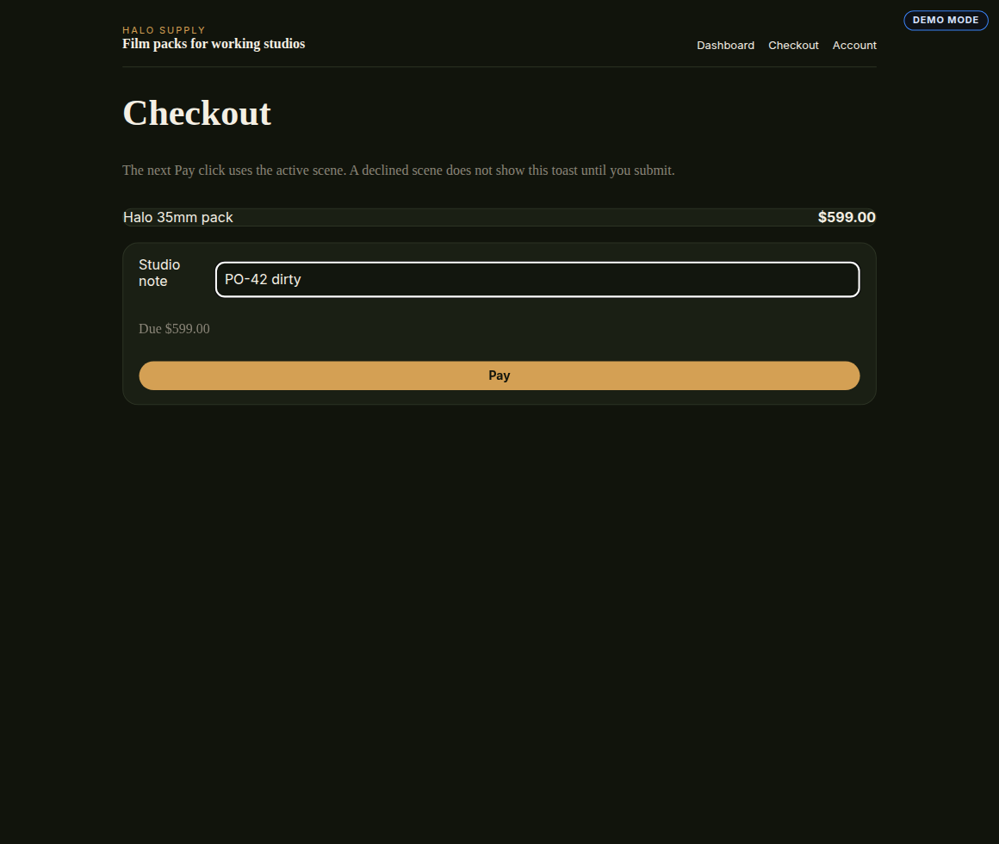
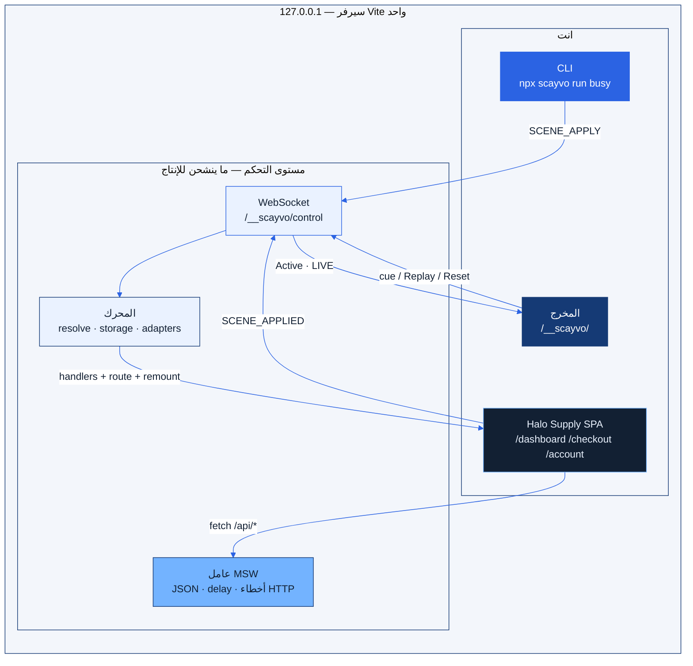
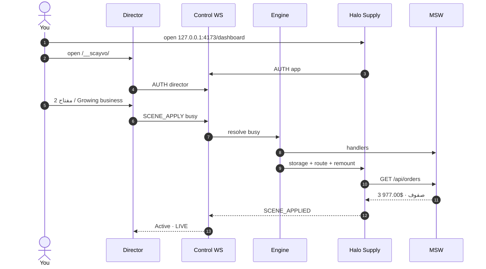

<p align="center">
  
</p>

<h1 align="center">SCAYVO</h1>

<p align="center" dir="rtl" lang="ar">
  <strong>عرضك الجاي. بمفتاح واحد.</strong><br />
  وحدة تحكم مشهد محلية لتطبيق React + Vite شغال.
</p>

<p align="center">
  <a href="./README.md">English</a> ·
  <a href="./README.nl.md">Nederlands</a> ·
  <a href="./README.ar.md">العربية</a>
</p>

<p align="center">
  
  
  
  
  
  
</p>

<p align="center">
  
</p>

<p dir="rtl" lang="ar" align="right">
عرّف العرض مرة واحدة. بدّل المسارات وموكات MSW والتخزين المصرّح فيه بمفتاح — بدون إعادة بناء، بدون إعادة تحميل كاملة، وبدون <code>localStorage.clear()</code>.
</p>

<p dir="rtl" lang="ar" align="right">
المخرج يعيش على <strong>نفس سيرفر Vite</strong> في <code>/__scayvo/</code>. بناء الإنتاج <strong>ما يشحن</strong> مسارات التحكم ولا العامل ولا الـ fixtures.
</p>

---

## شاهد

[**▶ الجولة كاملة (MP4، نحو 90 ثانية)**](docs/assets/walkthrough.mp4)

<p align="center">
  
</p>

<p align="center">
  <a href="docs/assets/walkthrough.mp4">
    
  </a>
</p>

---

## المعرض

<p align="center">
  
</p>

| المخرج | عرض Halo Supply |
| :---: | :---: |
|  |  |
|  |  |
|  |  |

<p align="center">
  
</p>

<p align="center">
  
  
  
  
</p>

---

## المحتويات

- [ما هو](#ما-هو)
- [كيف يتراكب](#كيف-يتراكب)
- [لوحة الألوان](#لوحة-الألوان)
- [وش ما يسويه v0.1](#وش-ما-يسويه-v01)
- [تشغيل عرض Halo Supply](#تشغيل-عرض-halo-supply)
- [المخرج](#المخرج)
- [الكيبورد](#الكيبورد)
- [التثبيت في تطبيقك](#التثبيت-في-تطبيقك)
- [CLI](#cli)
- [كيف ينطبق المشهد](#كيف-ينطبق-المشهد)
- [الشبكة والتخزين](#الشبكة-والتخزين)
- [الاختبارات من الألف إلى الياء](#الاختبارات-من-الألف-إلى-الياء)
- [خريطة المستودع](#خريطة-المستودع)
- [التوثيق](#التوثيق)
- [استكشاف الأخطاء](#استكشاف-الأخطاء)
- [الكاتب والدعم](#الكاتب-والدعم)
- [الترخيص](#الترخيص)

---

## ما هو

SCAYVO مخرج **على loopback فقط** للعروض:

| الجزء | وش يعطيك |
| --- | --- |
| المشاهد | عنوان، ترتيب، مسار، تخزين مصرّح، موكات REST، بيانات محول |
| المخرج | لوحة كحلية فاتحة على `/__scayvo/` في **نفس** عملية Vite |
| Remote | المفاتيح دائمًا في المخرج؛ في تبويب **التطبيق** فقط بعد Remote mode |
| React | إعادة تركيب صريحة + أجيال قابلة للإلغاء (`context.signal`) |
| الشبكة | MSW في المتصفح: JSON، fixtures، أخطاء HTTP، تأخير، أخطاء شبكة |
| CLI | `init` · `dev` · `list` · `run` · `reset` · `validate` |

v0.1 يتحكم في **مصادر مصرّح فيها ومحولات مسجّلة فقط**. ما يدّعي «أي حالة»، ولا قواعد بيانات، ولا SSR، ولا كوكيز، ولا IndexedDB، ولا ترافيك إنتاج.

اسم npm العام `scayvo` عنوان عمل. **هذا المستودع ما ينشر على npm.** لا تسوي `npm install scayvo` من السجل. ابنِ tarball محلي.

---

## كيف يتراكب

عملية Vite واحدة. التطبيق والمخرج والـ WebSocket وعامل MSW ما يطلعون من loopback.



Apply = **خط أساس + افتراضيات + مشهد**. يعيد التحضير حتى للمشهد الحالي.



---

## لوحة الألوان

المخرج كحلي + أزرق إشارة على ورق ثلجي. Halo Supply واجهة متجر داكنة منفصلة — هذا التطبيق التجريبي، مو الأداة.

<p align="center">
  
  
  
  
  
</p>

| الرمز | Hex | أين |
| --- | --- | --- |
| Navy | `#153a75` | الشريط، فيلم مود، الزر الأساسي |
| Signal blue | `#2b63e3` | التركيز، الروابط، LIVE |
| Sky | `#73b3ff` | الحدود، التوهج، إطار الشارة |
| Ice | `#eaf2ff` | بطاقات الحالة، البحث، صف LIVE |
| Heat | `#e05645` | Reset، الأخطاء، الاستعادة |
| Paper | `#f3f6fb` | خلفية المخرج |
| Ink | `#122033` | النص |

الخطوط: **Plus Jakarta Sans** للواجهة + **IBM Plex Mono** للمعرّفات والاختصارات.

---

## وش ما يسويه v0.1

ساعة وهمية عالمية، Next.js/SSR، GraphQL، موكات WebSocket، التقاط، سحابة، ذكاء اصطناعي، فوترة، محرر مشاهد بصري، اختصارات على مستوى نظام التشغيل، التعايش مع عامل PWA.

---

## تشغيل عرض Halo Supply

Node **≥ 20.11**. ابقَ على loopback.

### 1) انسخ وابنِ

```bash
git clone https://github.com/Scayar/SCAYVO.git
cd SCAYVO
npm install
npm run build
```

### 2) ثبّت تبعيات العرض

```bash
npm install --prefix examples/demo
```

هذا يثبّت React وVite و`scayvo` عبر `file:../..`.

### 3) شغّل Vite — الأمر الصحيح

سكربت الجذر `npm run demo` يستدعي `npm run start --prefix examples/demo`. **ما يمرّر** `--host` و`--port` إلى Vite. لا تكتب `npm run demo -- --host ...`.

**من جذر المستودع (موصى به):**

```bash
npm run start --prefix examples/demo -- --host 127.0.0.1 --port 4173 --strictPort
```

أو من مجلد العرض:

```bash
cd examples/demo
npm start -- --host 127.0.0.1 --port 4173 --strictPort
```

`examples/demo/vite.config.ts` مربوط أصلًا على `127.0.0.1:4173`. تمرير `--host 0.0.0.0` **يعطّل** مسارات التحكم.

انتظر حتى Vite يطبع الرابط المحلي.

### 4) افتح نافذتين

| السطح | الرابط | وش تشوف |
| --- | --- | --- |
| التطبيق | http://127.0.0.1:4173/ | Halo Supply + شارة `DEMO MODE` |
| المخرج | http://127.0.0.1:4173/__scayvo/ | لوحة التحكم |

المخرج **مو** سيرفر منفصل. هو مسار على **نفس** Vite. مسار المخرج وحده ما يكفي — لازم تبويب التطبيق على **نفس الأصل**.

Halo Supply متجر بثلاثة مسارات (`/dashboard` `/checkout` `/account`). ستة مشاهد تمر عبر `fetch('/api/…')`، مو عبر قراءة معرّف مشهد في الـ markup.

| مفتاح | المشهد | وش المفروض تشوف |
| --- | --- | --- |
| `1` | Empty dashboard | 0 طلبات، **$0.00** |
| `2` | Growing business | 3 طلبات، **$977.00** من الـ fixture (59900 + 12900 + 24900 سنت) |
| `3` | Slow API | هيكل عظمي ~4 ثوانٍ، ثم نفس الطلبات الثلاثة |
| `4` | Server error | خطأ لوحة من HTTP 500 (`demo_server_error`) |
| `5` | Payment declined | Checkout. التوست **بعد** Pay فقط (`card_declined`) |
| `6` | Premium account | الاسم Talal، الخطة `premium` |

**Replay** (`Space`) على payment-failed يمسح النموذج والتوست، ثم Pay يفشل مرة ثانية. **Reset** يرجع المفاتيح المُدارة والمسار الأصلي ثم يركّب **بدون** موكات SCAYVO. إذا ما في باكند حقيقي، `/api/orders` قد يرجع HTML — هذا الوضع الطبيعي الصادق، مو عطل استعادة.

### 5) CLI بينما السيرفر شغال

من `examples/demo` حتى يقرأ `.scayvo/runtime.json`:

```bash
cd examples/demo
npx scayvo list
npx scayvo run busy
npx scayvo run payment-failed
npx scayvo reset
```

`run` ينتظر `SCENE_APPLIED`. ما فيه `--base-url` — الهوست والتوكن من ملف التشغيل.

### 6) ابنِ tarball لتطبيق ثاني

```bash
npm pack
# يطلع scayvo-0.1.0.tgz
```

```bash
cd /path/to/your-app
npm install -D /absolute/path/to/scayvo-0.1.0.tgz
npx scayvo init
```

**لا تحمّل حزمة `scayvo` من npm العام** — أداة ثانية، مو هذا المشروع.

---

## المخرج

نفس أصل التطبيق. زر كحلي، بطاقات ثلجية، ورقة إشارات، نقل، قائمة اختصارات.

<p align="center">
  
</p>

| التحكم | المعنى |
| --- | --- |
| Cue sheet | اضغط مشهد. الصف النشط ثلجي + **LIVE** |
| Replay scene | يعيد تحضير حتى **المشهد الحالي** |
| Previous / Next | بدون لف دائري |
| Reset | خط الأساس + تركيب عادي، الموكات مطفأة |
| Remote mode in app | أرقام/أسهم/Space في تبويب **التطبيق** |
| Hide DEMO MODE badge | نص الشارة يبقى `DEMO MODE` للاختبارات |
| Film mode (`D`) | عرض كبير. `Esc` يخرج |
| Search (`/`) | صفِّ حسب العنوان أو المعرّف أو المفتاح |
| Diagnostics | أخطاء المحرك والطلبات المحجوبة داخل النطاق |

المصافحة: **Connected** بعد مصادقة التطبيق. **Active** فقط بعد `SCENE_APPLIED`. اتصال السوكت وحده مو نجاح.

إذا انقطع آخر مخرج، الموكات **تبقى**. ما تسقط للشبكة الحقيقية.

تحت 900px الشريط الجانبي ينطوي فوق. على الجوال بطاقات الحالة عمودين.

---

## الكيبورد

الاختصارات تتجاهل الكتابة، IME، المعدّلات، وتكرار المفتاح. على مستوى الصفحة، مو نظام التشغيل.

| المفتاح | الإجراء |
| --- | --- |
| `1`–`9` | المشهد حسب `order` |
| `←` `→` | السابق / التالي، بدون لف |
| `Space` | Replay للمشهد الحالي |
| `R` | Reset |
| `D` | وضع الفيلم (المخرج) |
| `/` | تركيز البحث (المخرج) |
| `Esc` | خروج من الفيلم (المخرج)؛ إطفاء Remote في **التطبيق** |

الأرقام والأسهم في تبويب التطبيق تشتغل فقط بعد **Remote mode in app**.

---

## التثبيت في تطبيقك

### 1. tarball محلي (مو السجل العام)

```bash
cd /path/to/SCAYVO
npm install
npm run build
npm pack
```

```bash
cd /path/to/your-app
npm install -D /path/to/scayvo-0.1.0.tgz
npx scayvo init
```

`init` يكتب `scayvo.config.ts` و`src/scayvo.dev.ts` وfixture نموذجي **فقط إذا ما كانت موجودة**. يطبع كتلتي الدمج. ما يعيد كتابة ملفات إقلاع مجهولة، وما يدّعي إن المصافحة نجحت.

### 2. إضافة Vite

```ts
// vite.config.ts
import { defineConfig } from 'vite';
import react from '@vitejs/plugin-react';
import { scayvo } from 'scayvo/vite';

export default defineConfig({
  plugins: [react(), scayvo()],
  server: { host: '127.0.0.1' },
});
```

نقاط التحكم موجودة فقط أثناء `vite` **serve**، وفقط على loopback (`localhost`، `127.0.0.1`، `::1`).

### 3. احجب الإنتاج

```ts
// src/main.ts
async function main() {
  if (import.meta.env.DEV) {
    const { startDemoDevelopment } = await import('./scayvo.dev');
    await startDemoDevelopment();
    return;
  }
  const { mountNormalApp } = await import('./bootstrap');
  await mountNormalApp();
}

void main();
```

### 4. ملف الجلسة

سجّل المحولات المذكورة في `custom`، انتظر SCAYVO (بما فيه عامل MSW)، ثم استورد الوحدات اللي تسوي `fetch`.

```ts
import { startScayvo } from 'scayvo/client';

export async function startDemoDevelopment() {
  const { mountApp } = await import('./bootstrap');
  await startScayvo({
    adapters: { user: userAdapter },
    integration: {
      async mount(context) {
        return mountApp(context);
      },
    },
  });
}
```

اختياري: `scayvo/react` → `createReactIntegration(target, render)` يستخدم `flushSync` لأول commit.

أنشئ الـ stores وعملاء الاستعلام والمتفردات القابلة للتغيير **داخل `mount`** (أو صفّرها في المحولات). إعادة تركيب React ما تصفّر كاش على مستوى الوحدة. مرّر `context.signal` إلى `fetch`.

`mount` ينحل بعد أول هيكل صالح، مو بعد كل طلب شبكة. عشان كذا Slow API يقدر يكون **Active** والهيكل لسا ظاهر.

`dispose()` لازم يلغي الجلب والتايمر والاشتراكات ثم يفك التركيب.

الصادرات العامة: `scayvo`، `scayvo/vite`، `scayvo/client`، `scayvo/react`.

---

## CLI

الثنائي: `scayvo` → `dist/cli/index.js`. شغّله من مجلد **التطبيق** (حيث `scayvo.config.ts`). `run` / `reset` يحتاجون Vite شغال حتى يوجد `.scayvo/runtime.json`.

```bash
npx scayvo init                 # هيكل الإعداد + ملف الجلسة إن ناقص
npx scayvo validate             # المخطط، التداخل، الـ fixtures، هروب الروابط
npx scayvo list                 # المشاهد بالترتيب (بدون سيرفر)
npx scayvo dev                  # Vite على 127.0.0.1 + يطبع رابط المخرج
npx scayvo run payment-failed   # ينتظر SCENE_APPLIED
npx scayvo reset
```

Halo Supply من طرفية ثانية بينما العرض شغال:

```bash
cd examples/demo
npx scayvo list
npx scayvo run busy
npx scayvo run payment-failed
npx scayvo reset
```

`run` يتكلم مع سيرفر تطوير **شغال أصلًا** عبر ملف التشغيل. ما يأخذ `--base-url`. ما يفتح متصفح. الخروج فقط بعد إقرار التطبيق.

| الرمز | المعنى |
| --- | --- |
| `0` | تمام |
| `1` | تنفيذ |
| `2` | إعداد غير صالح |
| `3` | لا اتصال / لا عميل |
| `4` | مشغول / انتهت المهلة |

---

## كيف ينطبق المشهد

المشاهد تُحل كـ **خط أساس + افتراضيات + مشهد**. ما ترث بقايا المشهد السابق.

Apply **يعيد التحضير حتى للمشهد الحالي**. Replay صريح ويسوي نفس الشيء. بدون إعادة تحميل كاملة للصفحة.

`payment-failed` يعني إن طلب Pay **الجاي** يفشل. توست الرفض ما يظهر إلا بعد الإرسال. v0.1 ما يضغط الـ DOM عنك.

الإعداد TypeScript محلي موثوق يحمّله Node. معرّفات المشاهد kebab-case صغيرة. `order` يذكر كل مشهد مرة. `initialScene` لازم يكون في القائمة. الـ fixtures نسبية للإعداد، تُتحقق كـ JSON ثم تُضمَّن. المسارات المطلقة والخروج بالروابط الرمزية خارج جذر المشروع تفشل **قبل** أي تغيير.

تعديل `scayvo.config.ts` أثناء جلسة حية يظهر **Configuration changed**. Reset ثم أعد التحميل. HMR للإعداد مؤجّل.

---

## الشبكة والتخزين

- المطابقات حرفية (`/api/orders`). مفاتيح الاستعلام الزائدة مسموحة؛ المفاتيح المصرّح فيها بالمساواة. التداخل يفشل `validate`.
- `network.scope` بحدود المسار: `/api/` ما يطابق `/apiary`. الأصول وHMR لـ Vite يمرّون.
- الطلبات داخل النطاق بدون مطابق **تُحجب** وتُعرض في المخرج.
- أخطاء HTTP من الموكات بيانات مشهد، مو فشل محرك.
- `delayMs` من 0 إلى 30000. مو مهلة تطبيق. لعرض مهلة التطبيق، ألغِ قبل تأخير الموك.
- رقع التخزين فقط لمفاتيح `managedStorage`. `null` يحذف مفتاح. SCAYVO **ما يستدعي أبدًا** `localStorage.clear()`.
- عميل تطبيق واحد لكل جلسة. تبويب تطبيق ثاني يُرفض.
- MSW هو المعترض. ما في ترقيع `fetch` يدوي. ما في GraphQL / WebSocket في v0.1.

---

## الاختبارات من الألف إلى الياء

مُسجَّلة ضد هذا المستودع. مو أرقام وهمية.

من الجذر، بعد `npm install` و`npm install --prefix examples/demo`. المنفذ **4173 لازم يكون فاضي** — Playwright يشغّل Vite بنفسه و`reuseExistingServer: false`.

```bash
npm run typecheck     # tsc --noEmit (الحزمة، المخرج، مصدر Halo Supply)
npm run test          # Vitest — وحدة + تكامل
npx playwright install chromium
npm run test:e2e      # Playwright Chromium ضد examples/demo على :4173
npm run test:all
```

| المجموعة | آخر تشغيل | النتيجة |
| --- | --- | --- |
| Vitest | 15 سبتمبر 2026 | **25 نجح** |
| Playwright Chromium | 15 سبتمبر 2026 | **14 نجح** |

**Vitest** — المخطط/التداخل/المفاتيح غير المُدارة/الـ fixtures، دمج خط الأساس، المطابقات (`/api/` مقابل `/apiary`)، قائمة التخزين، تجاهل الكيبورد، أمان loopback، نص `ADAPTER_MISSING`، عزل حزمة الإنتاج (بدون `/__scayvo` والعامل والـ fixtures وعناوين المشاهد)، `init` / `validate` / `list` على tarball نظيف.

**Playwright** — إقلاع بارد قبل ما `/api` يضرب Vite، A→B→A بدون تسريب، عزل slow→busy، Replay لـ payment-failed، Reset للمفاتيح المُدارة، التحديث يحافظ على خط الأساس الأصلي، حجب داخل النطاق بدون مطابق، انفجار أوامر / BUSY، التركيز + remote، رفض تبويب تطبيق ثاني، HTTP غير مصرّح، قطع المخرج يُبقي الموكات، الأصول خارج `/api/`، p95 من التطبيق إلى الهيكل &lt; ثانية على 30 تبديل.

**غير مؤتمت:** محول يرمي أثناء التطبيق؛ `WORKER_CONFLICT` ضد عامل PWA أجنبي؛ لقطات بكسل بصرية (مقصودة). Firefox/WebKit غير مشغَّلين هنا.

التفاصيل: [tests/RESULTS.md](tests/RESULTS.md).

---

## خريطة المستودع

```text
src/core/        الأنواع، defineScayvo، التحقق، الحل، الـ fixtures
src/vite/        الإضافة، HTTP/WS على loopback، عامل MSW، ثابت المخرج
src/client/      المحرك، التخزين، اليومية، الكيبورد، الشارة، تشغيل MSW
src/react/       createReactIntegration (flushSync)
src/cli/         init, dev, list, run, reset, validate
src/director/    واجهة المخرج (تُبنى إلى dist/director)
examples/demo/   Halo Supply
docs/            البدء، الحدود، التكاملات، الأصول
tests/           وحدة، تكامل، Playwright
```

---

## التوثيق

| الملف | الموضوع |
| --- | --- |
| [docs/getting-started.md](docs/getting-started.md) · [NL](docs/getting-started.nl.md) · [AR](docs/getting-started.ar.md) | الحزمة، الإعداد، ثلاث لمسات، mount، المصافحة |
| [docs/limits.md](docs/limits.md) · [NL](docs/limits.nl.md) · [AR](docs/limits.ar.md) | الحالة، الشبكة، العمال، مستوى التحكم، الاستعادة، الصدق |
| [docs/integrations.md](docs/integrations.md) · [NL](docs/integrations.nl.md) · [AR](docs/integrations.ar.md) | React، المحولات، MSW، هاش الإعداد |
| [docs/README.md](docs/README.md) | الفهرس + فهرس الصور |
| [docs/github-presence.md](docs/github-presence.md) | وصف GitHub، التوبيكس، منشور الإطلاق |
| [CONTRIBUTING.md](CONTRIBUTING.md) | كيف تساهم |
| [SECURITY.md](SECURITY.md) | الثغرات |
| [examples/demo/README.md](examples/demo/README.md) | Halo Supply |
| [LICENSE](LICENSE) | MIT |

---

## استكشاف الأخطاء

| العَرَض | السبب الأرجح |
| --- | --- |
| المخرج يبقى على Waiting | تبويب التطبيق مو على نفس الأصل، أو فرع الإنتاج من `main` اشتغل |
| `/__scayvo/` ‏404 | السيرفر مو `vite` serve، أو الهوست مو loopback |
| التوست ظاهر أصلًا على payment-failed | المشهد = Pay **الجاي** يفشل؛ اضغط Pay |
| بعد Reset تحليل JSON لـ `<!DOCTYPE` | ما في باكند `/api` حقيقي — متوقع |
| `WORKER_CONFLICT` | Service Worker ثاني على نفس النطاق؛ SCAYVO ما يلغي تسجيله |
| `npm install scayvo` من npm | حزمة غلط — pack هذا الريبو |
| Playwright `4173 is already used` | أوقف العرض ثم `npx playwright test` |
| `npm run demo -- --host` ما يغيّر المنفذ | الخيارات ما توصل Vite. استخدم `npm run start --prefix examples/demo -- …` |

---

## الترخيص

MIT. أداة تطوير محلية. لا تعرض `/__scayvo/` على شبكة مشتركة.

---

## الكاتب والدعم

**[Scayar](https://github.com/Scayar)** — هولندا. [Scayar.com](https://Scayar.com) · [MezaOS](https://MezaOS.com)

<p align="center">
  <a href="https://Scayar.com"></a>
  <a href="mailto:Scayar.exe@gmail.com"></a>
  <a href="https://t.me/im_scayar"></a>
  <a href="https://buymeacoffee.com/scayar"></a>
</p>

<p align="center">
  <br />
  <sub>من <a href="https://scayar.com">Scayar</a> · عرضك الجاي. بمفتاح واحد.</sub>
</p>
