<p align="center">
  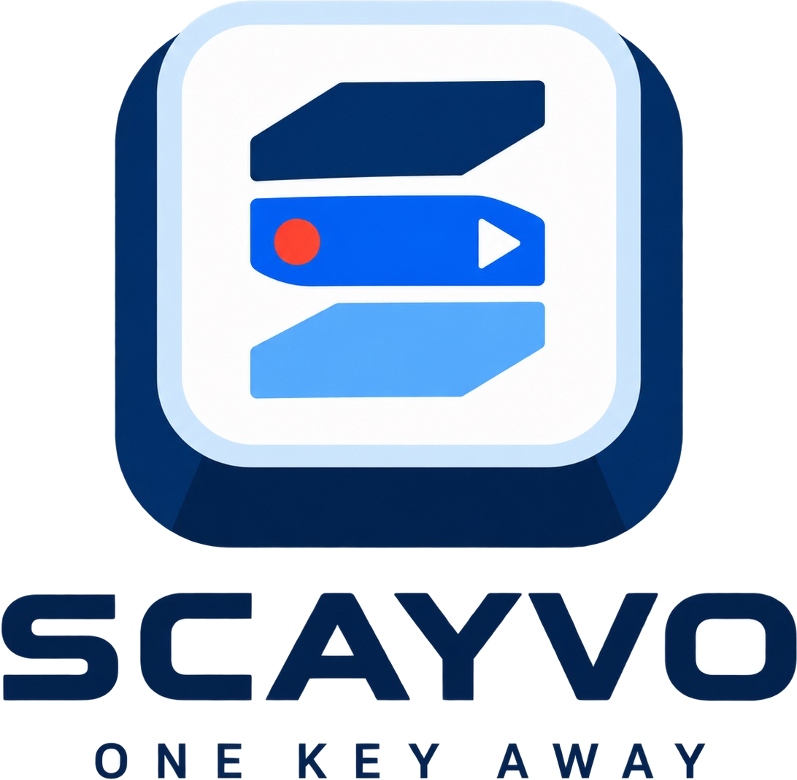
</p>

<p align="center">
  <a href="./README.md">English</a> ·
  <a href="./README.nl.md">Nederlands</a> ·
  <a href="./README.ar.md">العربية</a>
</p>

<p align="center">
  
  
  
  
  
  
</p>

Local scene controller for a running React + Vite SPA. Define the demo once. Switch routes, MSW mocks, and allowlisted storage with a keypress — no rebuild, no full reload, no `localStorage.clear()`.

Director lives on the **same Vite server** at `/__scayvo/`. Production builds do not ship control routes, the worker, or fixtures.

---

## Watch it

[**▶ Full walkthrough (MP4, ~90s)**](docs/assets/walkthrough.mp4)

<p align="center">
  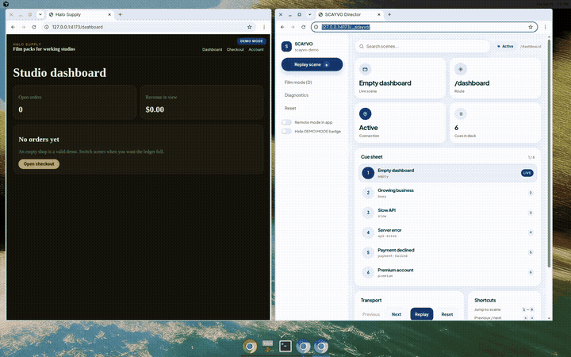
</p>

<p align="center">
  <a href="docs/assets/walkthrough.mp4">
    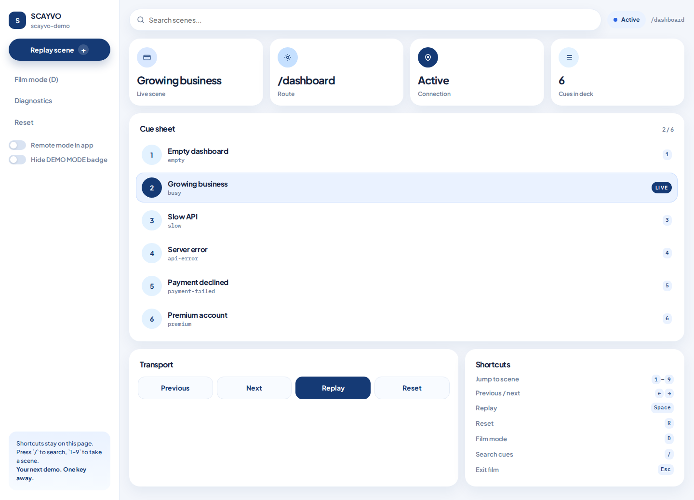
  </a>
</p>

---

## Gallery

<p align="center">
  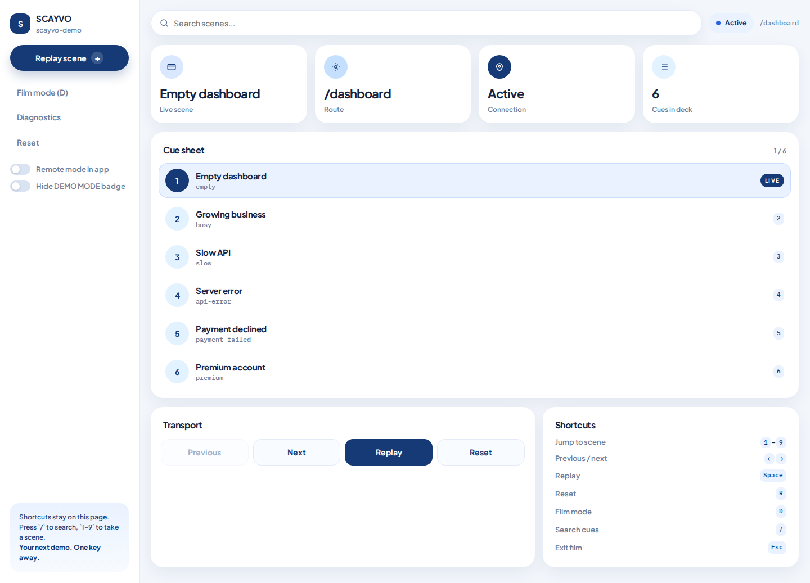
</p>

| Director | Halo Supply demo |
| :---: | :---: |
| 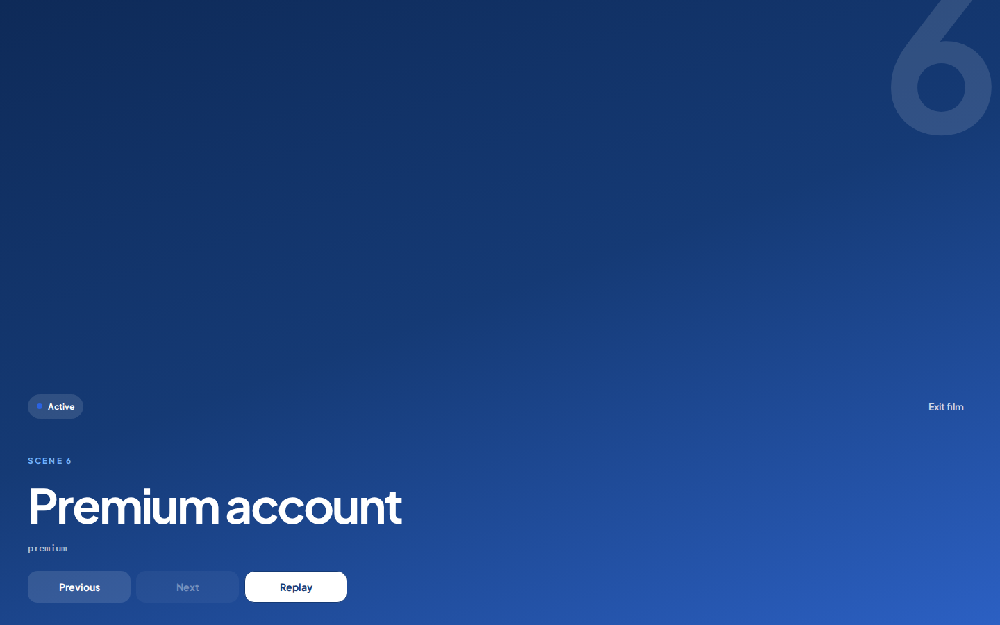 | 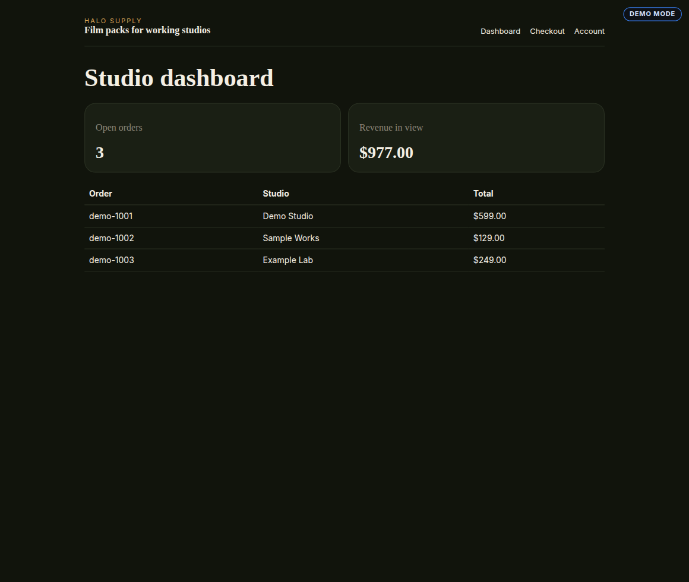 |
| 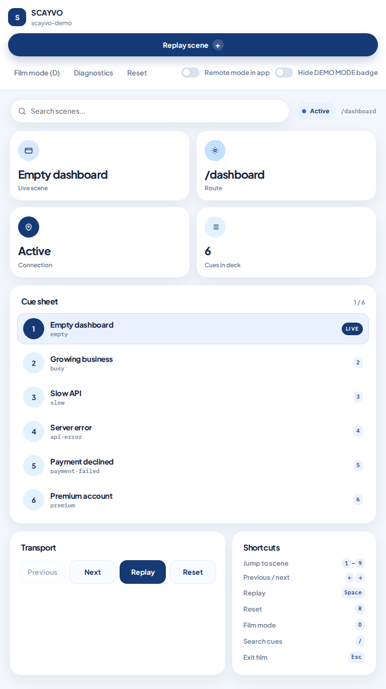 | 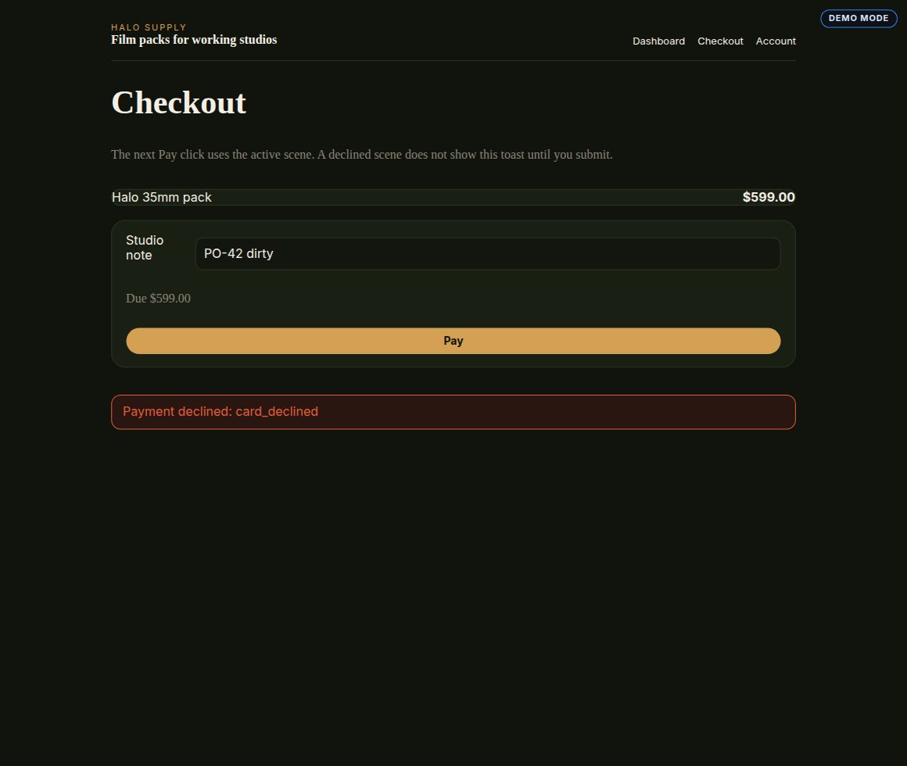 |
| 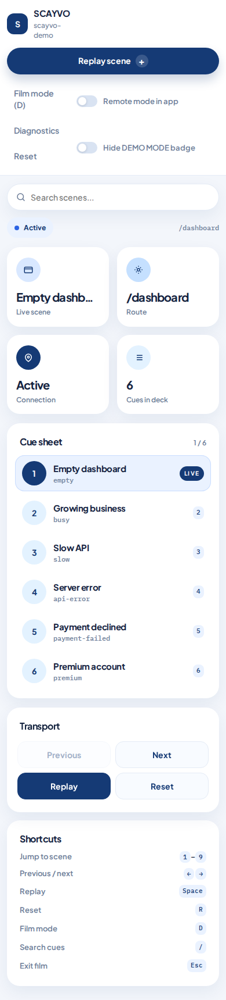 | 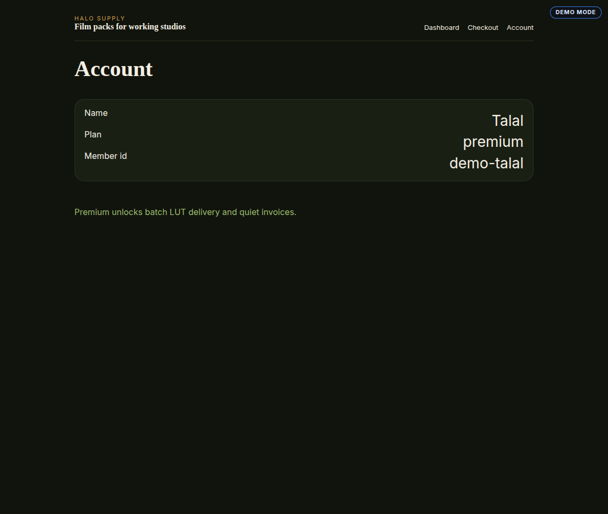 |

<p align="center">
  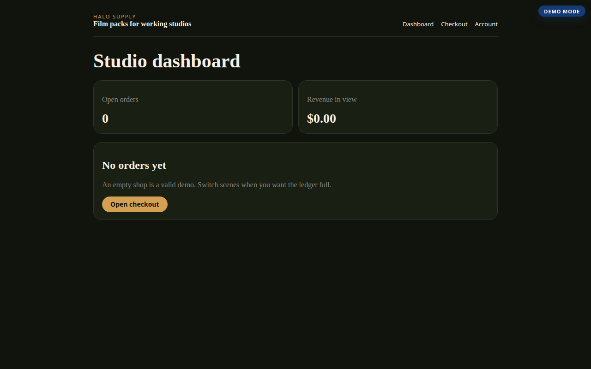
</p>

---

## Contents

- [What it is](#what-it-is)
- [How it fits together](#how-it-fits-together)
- [Palette](#palette)
- [What v0.1 does not do](#what-v01-does-not-do)
- [Run the Halo Supply demo](#run-the-halo-supply-demo)
- [Director](#director)
- [Keyboard](#keyboard)
- [Install into your app](#install-into-your-app)
- [CLI](#cli)
- [How a scene applies](#how-a-scene-applies)
- [Network and storage](#network-and-storage)
- [Tests (A→Z)](#tests-az)
- [Repository map](#repository-map)
- [Docs](#docs)
- [Troubleshooting](#troubleshooting)
- [Author and support](#author-and-support)
- [License](#license)

---

## What it is

SCAYVO is a **loopback-only** director for demos:

| Piece | What you get |
| --- | --- |
| Scenes | Title, order, route, allowlisted storage, REST mocks, custom adapter data |
| Director | Light navy dashboard at `/__scayvo/` on the same Vite process |
| Remote | Keys always work in Director; the **app** tab only after Remote mode |
| React | Explicit remount + abortable generations (`context.signal`) |
| Network | MSW in the browser: JSON, fixtures, HTTP errors, delay, network errors |
| CLI | `init` · `dev` · `list` · `run` · `reset` · `validate` |

v0.1 controls **declared sources and registered adapters only**. It does not claim “any state,” databases, SSR, cookies, IndexedDB, or production traffic.

The public npm name `scayvo` is a working title. **This repository does not publish to npm.** Do not `npm install scayvo` from the registry. Pack a local tarball.

---

## How it fits together

One Vite process. The app, Director, WebSocket, and MSW worker never leave loopback.

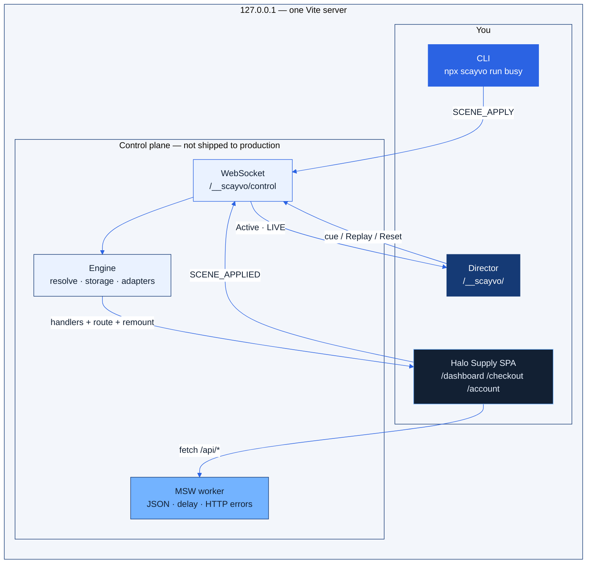
```mermaid
%%{init: {"theme":"base","themeVariables":{"primaryColor":"#eaf2ff","primaryTextColor":"#122033","primaryBorderColor":"#153a75","lineColor":"#2b63e3","secondaryColor":"#73b3ff","tertiaryColor":"#f3f6fb","clusterBkg":"#f3f6fb","clusterBorder":"#153a75","edgeLabelBackground":"#ffffff"}}}%%
flowchart TB
  subgraph host["127.0.0.1 — one Vite server"]
    direction TB
    subgraph ui["You"]
      D["Director<br/>/__scayvo/"]
      H["Halo Supply SPA<br/>/dashboard /checkout /account"]
      C["CLI<br/>npx scayvo run busy"]
    end
    subgraph plane["Control plane — not shipped to production"]
      WS["WebSocket<br/>/__scayvo/control"]
      E["Engine<br/>resolve · storage · adapters"]
      M["MSW worker<br/>JSON · delay · HTTP errors"]
    end
  end

  D -->|"cue / Replay / Reset"| WS
  C -->|"SCENE_APPLY"| WS
  WS --> E
  E -->|"handlers + route + remount"| H
  H -->|"fetch /api/*"| M
  H -->|"SCENE_APPLIED"| WS
  WS -->|"Active · LIVE"| D

  style D fill:#153a75,stroke:#153a75,color:#ffffff
  style H fill:#122033,stroke:#73b3ff,color:#eaf2ff
  style C fill:#2b63e3,stroke:#2b63e3,color:#ffffff
  style WS fill:#eaf2ff,stroke:#2b63e3,color:#122033
  style E fill:#eaf2ff,stroke:#153a75,color:#122033
  style M fill:#73b3ff,stroke:#153a75,color:#122033
```

Apply is **baseline + defaults + scene**. It re-prepares even the current scene. No full reload. No `localStorage.clear()`.

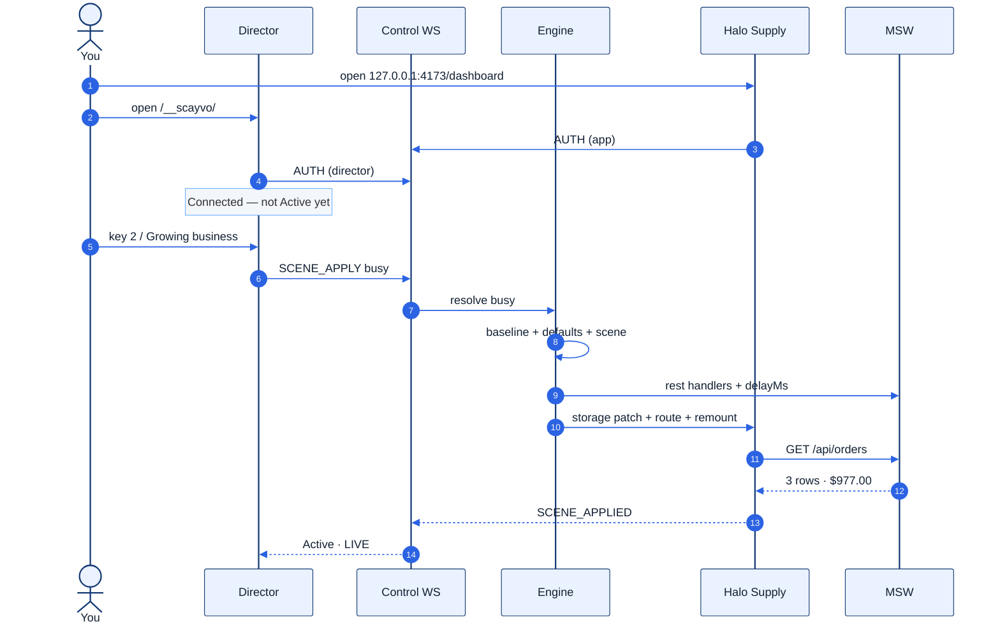
```mermaid
%%{init: {"theme":"base","themeVariables":{"actorBkg":"#eaf2ff","actorBorder":"#153a75","actorTextColor":"#122033","signalColor":"#2b63e3","signalTextColor":"#122033","noteBkgColor":"#f3f6fb","noteBorderColor":"#73b3ff"}}}%%
sequenceDiagram
  autonumber
  actor You
  participant Director
  participant Control as Control WS
  participant Engine
  participant App as Halo Supply
  participant MSW

  You->>App: open 127.0.0.1:4173/dashboard
  You->>Director: open /__scayvo/
  App->>Control: AUTH (app)
  Director->>Control: AUTH (director)
  Note over Director: Connected — not Active yet

  You->>Director: key 2 / Growing business
  Director->>Control: SCENE_APPLY busy
  Control->>Engine: resolve busy
  Engine->>Engine: baseline + defaults + scene
  Engine->>MSW: rest handlers + delayMs
  Engine->>App: storage patch + route + remount
  App->>MSW: GET /api/orders
  MSW-->>App: 3 rows · $977.00
  App-->>Control: SCENE_APPLIED
  Control-->>Director: Active · LIVE
```

---

## Palette

Director is navy + signal blue on ice paper. Halo Supply stays a separate dark storefront — it is the sample app, not the tool.

<p align="center">
  
  
  
  
  
</p>

| Token | Hex | Where |
| --- | --- | --- |
| Navy | `#153a75` | Sidebar, film mode, primary CTA |
| Signal blue | `#2b63e3` | Focus, links, live accents |
| Sky | `#73b3ff` | Borders, glow, badge outline |
| Ice | `#eaf2ff` | Metric cards, search, LIVE row |
| Heat | `#e05645` | Reset, errors, recovery |
| Paper | `#f3f6fb` | Director canvas |
| Ink | `#122033` | Body text |

Type: **Plus Jakarta Sans** (UI) + **IBM Plex Mono** (ids, shortcuts).

---

## What v0.1 does not do

Global fake clock, Next.js/SSR, GraphQL, WebSocket mocks, capture, cloud, AI, billing, visual scene editors, OS-global hotkeys, PWA worker coexistence.

---

## Run the Halo Supply demo

Node **≥ 20.11**. Stay on loopback.

```bash
git clone https://github.com/Scayar/SCAYVO.git
cd SCAYVO
npm install
npm run build
npm install --prefix examples/demo
npm run start --prefix examples/demo -- --host 127.0.0.1 --port 4173 --strictPort
```

Open:

| Surface | URL |
| --- | --- |
| App | http://127.0.0.1:4173/ |
| Director | http://127.0.0.1:4173/__scayvo/ |

`examples/demo/vite.config.ts` already binds `127.0.0.1:4173`. Passing `--host 0.0.0.0` **disables** control routes.

Halo Supply is a three-route storefront. Six scenes are driven by `fetch('/api/…')`, not by reading a scene id to pick hardcoded markup.

| Key | Scene | What you should see |
| --- | --- | --- |
| `1` | Empty dashboard | 0 orders, **$0.00** |
| `2` | Growing business | 3 orders, **$977.00** from the fixture (59900 + 12900 + 24900 cents) |
| `3` | Slow API | Skeleton ~4s, then the same 3 orders |
| `4` | Server error | Dashboard error from HTTP 500 (`demo_server_error`) |
| `5` | Payment declined | Checkout. Toast only **after** Pay (`card_declined`) |
| `6` | Premium account | Name Talal, plan `premium` |

<p align="center">
  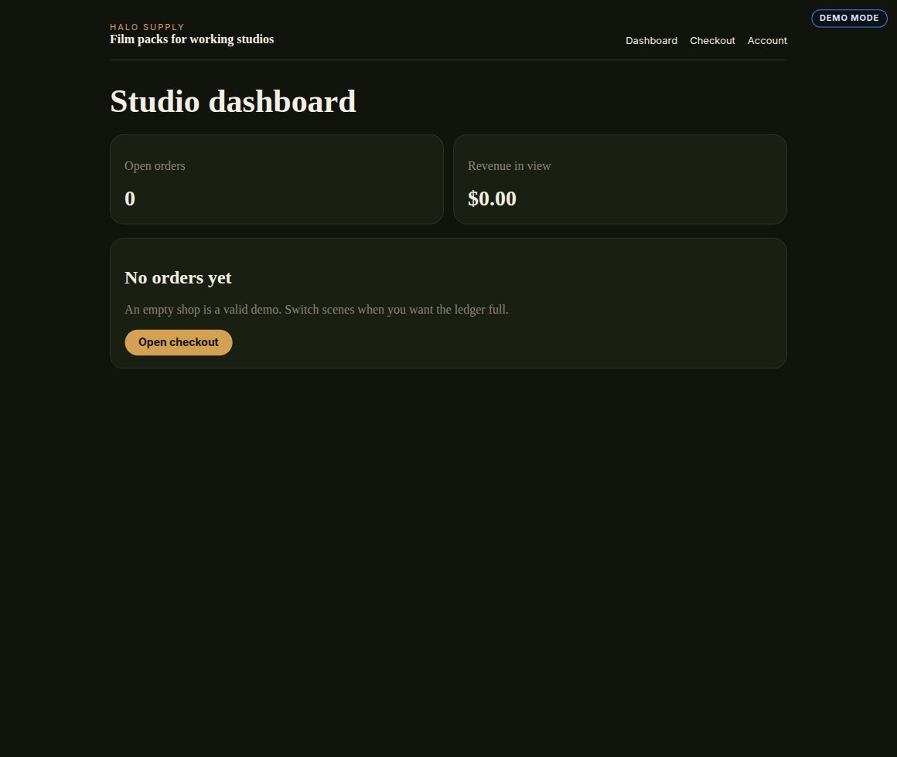
  
</p>
<p align="center">
  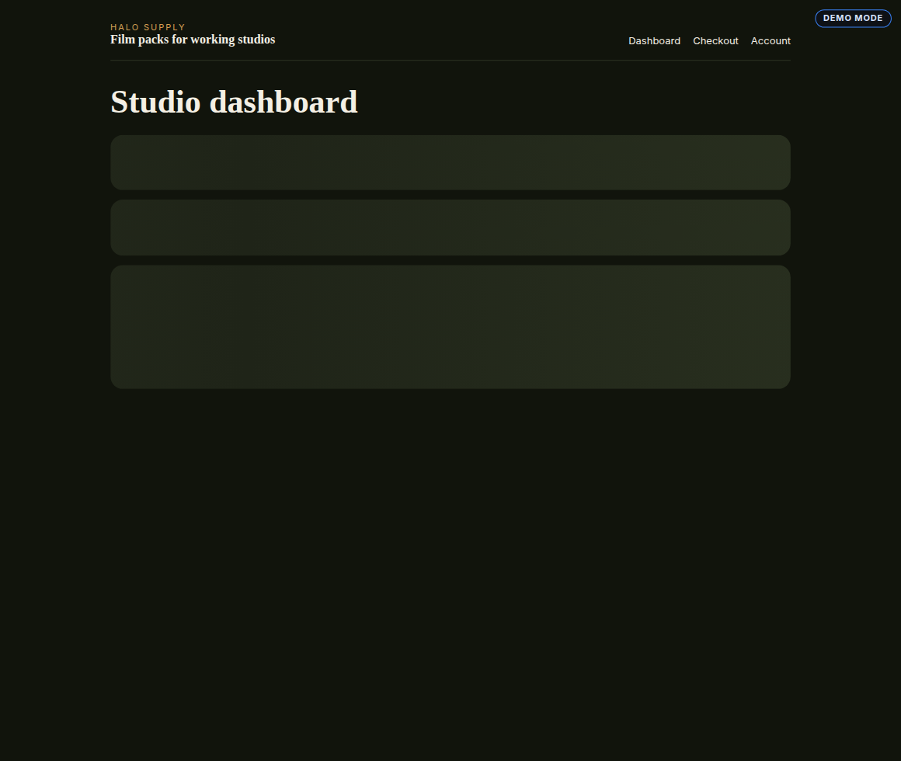
  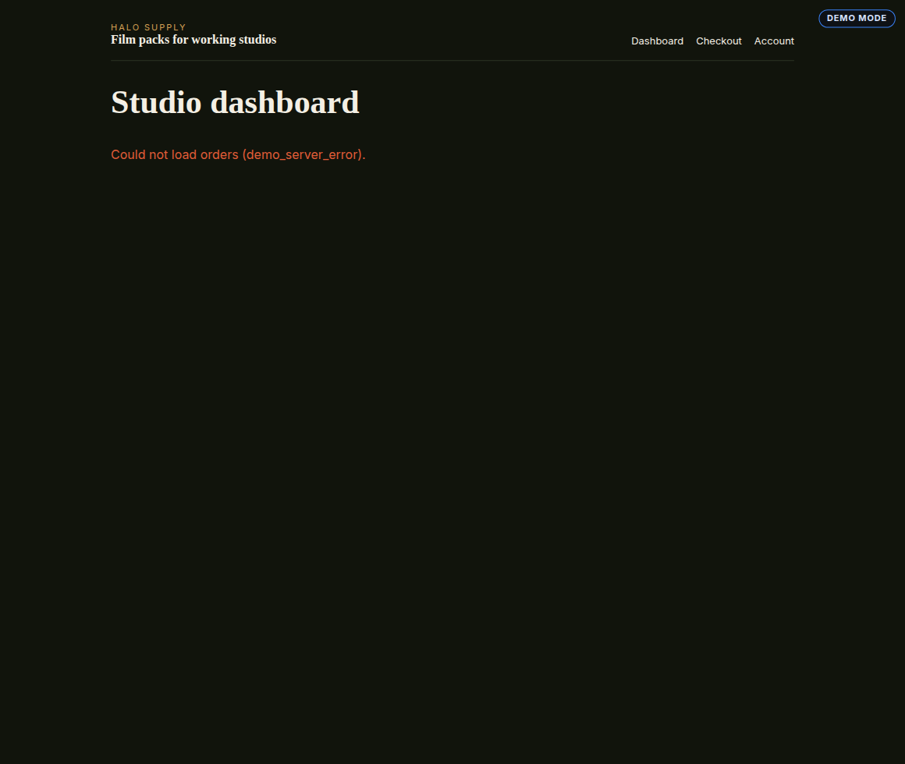
  
</p>

**Replay** (`Space`) on payment-failed clears the form and toast, then Pay fails again. **Reset** restores managed keys and the original route, then mounts **without** SCAYVO mocks. If there is no real backend, `/api/orders` may return HTML — that is honest normal mode, not a restore bug.

---

## Director

Same origin as the app. Deep navy CTA, ice metric cards, cue sheet, transport, shortcut list.

<p align="center">
  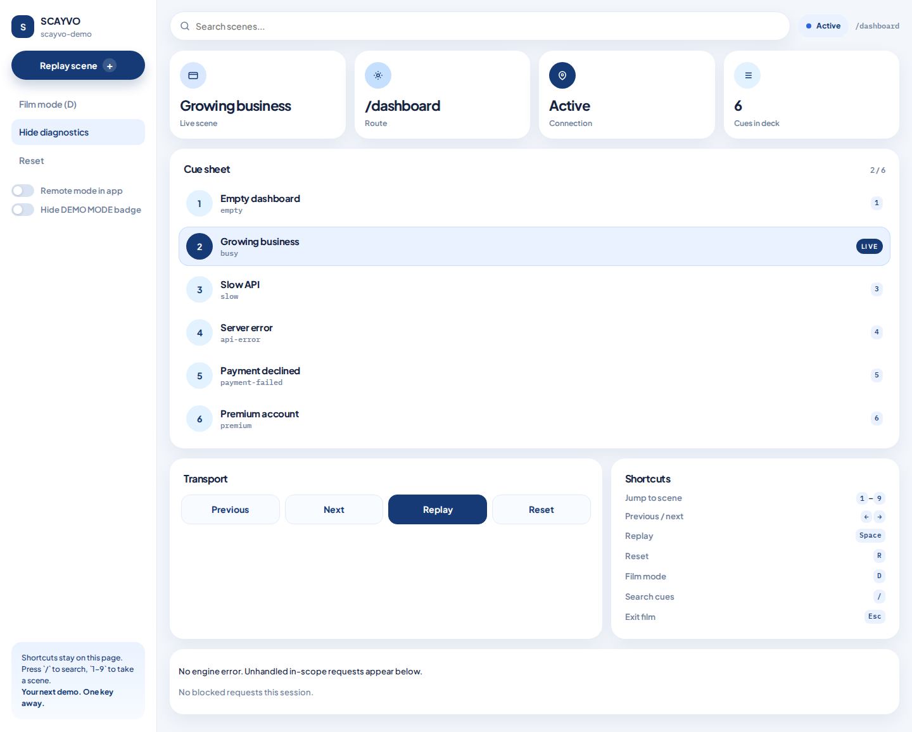
</p>

| Control | Meaning |
| --- | --- |
| Cue sheet | Click a scene. Active row is ice + **LIVE** |
| Replay scene | Re-prepares even the **current** scene |
| Previous / Next | No wrap |
| Reset | Baseline + normal mount, mocks off |
| Remote mode in app | Numbers/arrows/Space in the **app** tab |
| Hide DEMO MODE badge | Badge text stays `DEMO MODE` for tests |
| Film mode (`D`) | Large take view. `Esc` exits |
| Search (`/`) | Filter cues by title, id, or hotkey |
| Diagnostics | Engine errors and blocked in-scope requests |

Handshake: **Connected** after the app authenticates. **Active** only after `SCENE_APPLIED`. A socket connect alone is not success.

If the last Director disconnects, mocks **stay**. They do not fall through to the real network.

---

## Keyboard

Shortcuts ignore typing, IME, modifiers, and key repeat. They are page-level, not OS-global.

| Key | Action |
| --- | --- |
| `1`–`9` | Scene by `order` |
| `←` `→` | Previous / next, no wrap |
| `Space` | Replay current scene |
| `R` | Reset |
| `D` | Film mode (Director) |
| `/` | Focus scene search (Director) |
| `Esc` | Exit film (Director); turn off Remote in the **app** |

Numbers and arrows in the app tab work only after **Remote mode in app**.

---

## Install into your app

### 1. Local tarball (not the public registry)

```bash
cd /path/to/SCAYVO
npm install
npm run build
npm pack
```

```bash
cd /path/to/your-app
npm install -D /path/to/scayvo-0.1.0.tgz
npx scayvo init
```

`init` writes `scayvo.config.ts`, `src/scayvo.dev.ts`, and a sample fixture **only if they do not already exist**. It prints the two integration blocks. It does not rewrite unknown bootstrap files, and it does not claim the handshake succeeded.

### 2. Vite plugin

```ts
// vite.config.ts
import { defineConfig } from 'vite';
import react from '@vitejs/plugin-react';
import { scayvo } from 'scayvo/vite';

export default defineConfig({
  plugins: [react(), scayvo()],
  server: { host: '127.0.0.1' },
});
```

Control endpoints exist only during `vite` **serve**, and only on loopback (`localhost`, `127.0.0.1`, `::1`).

### 3. Gate production

```ts
// src/main.ts
async function main() {
  if (import.meta.env.DEV) {
    const { startDemoDevelopment } = await import('./scayvo.dev');
    await startDemoDevelopment();
    return;
  }
  const { mountNormalApp } = await import('./bootstrap');
  await mountNormalApp();
}

void main();
```

### 4. Session file

Register adapters named in `custom`, wait for SCAYVO (including the MSW worker), then import modules that can `fetch`.

```ts
import { startScayvo } from 'scayvo/client';

export async function startDemoDevelopment() {
  const { mountApp } = await import('./bootstrap');
  await startScayvo({
    adapters: { user: userAdapter },
    integration: {
      async mount(context) {
        return mountApp(context);
      },
    },
  });
}
```

Optional: `scayvo/react` → `createReactIntegration(target, render)` uses `flushSync` for the first commit.

Create stores, query clients, and other mutable singletons **inside `mount`** (or reset them in adapters). Remounting React does not reset module-level caches. Pass `context.signal` into `fetch`.

`mount` should resolve after the first usable shell, not after every network request. That is why Slow API can be **Active** while the skeleton is still on screen.

`dispose()` must abort fetches, timers, and subscriptions, then unmount.

Public exports: `scayvo`, `scayvo/vite`, `scayvo/client`, `scayvo/react`.

---

## CLI

Binary: `scayvo` → `dist/cli/index.js`. Run from the **app** directory (where `scayvo.config.ts` lives). `run` / `reset` need Vite already up so `.scayvo/runtime.json` exists.

```bash
npx scayvo init                 # scaffold config + session file if missing
npx scayvo validate             # schema, overlap, fixtures, symlink escape
npx scayvo list                 # scenes in order (no server required)
npx scayvo dev                  # Vite serve on 127.0.0.1 + print Director URL
npx scayvo run payment-failed   # waits for SCENE_APPLIED
npx scayvo reset
```

Halo Supply, from a second terminal while the demo is running:

```bash
cd examples/demo
npx scayvo list
npx scayvo run busy
npx scayvo run payment-failed
npx scayvo reset
```

`run` talks to an already running dev server via the runtime file. It does not take `--base-url`. It does not start a backend or open a browser. Exit only after the app acknowledgment.

| Code | Meaning |
| --- | --- |
| `0` | ok |
| `1` | exec |
| `2` | invalid config |
| `3` | no connection / client |
| `4` | busy / timeout |

---

## How a scene applies

Scenes resolve as **baseline + defaults + scene**. They never inherit leftover previous-scene state.

Apply **re-prepares even the current scene**. Replay is explicit and does the same. No full page reload.

`payment-failed` means the **next** Pay request fails. The declined toast must not appear until submit. v0.1 does not click the DOM for you.

Config is trusted local TypeScript loaded by Node. Scene ids are lowercase kebab-case. `order` lists every scene once. `initialScene` must be in that list. Fixtures are relative to the config, verified as JSON, then inlined. Absolute paths and symlink escapes outside the project root fail before any mutation.

Editing `scayvo.config.ts` while a session is live shows **Configuration changed**. Reset and reload. Config HMR is deferred.

---

## Network and storage

- Path matchers are literal (`/api/orders`). Extra query keys are allowed; declared keys use equality. Overlaps fail `validate`.
- `network.scope` uses path boundaries: `/api/` does not match `/apiary`. Assets and Vite HMR pass through.
- In-scope requests without a matcher are **blocked** and listed in Director.
- HTTP errors from mocks are scene data, not engine failure.
- `delayMs` is 0–30000. It is not an application timeout. To demo an app timeout, abort sooner than the mock delay.
- Storage patches apply only to `managedStorage` keys. `null` deletes a key. SCAYVO never calls `localStorage.clear()`.
- One app client per session. A second app tab is refused.
- MSW is the interceptor. No hand-rolled `fetch` patch. No GraphQL / WebSocket mocking in v0.1.

---

## Tests (A→Z)

Recorded against this repository. Not placeholders.

```bash
npm run typecheck     # tsc --noEmit (package, Director, Halo Supply src)
npm run test          # Vitest unit + integration
npx playwright install chromium
npm run test:e2e      # Playwright Chromium vs examples/demo on :4173
npm run test:all
```

Playwright starts its own server on **4173**. Stop anything else on that port first.

| Suite | Last run | Result |
| --- | --- | --- |
| Vitest | 15 Sep 2026 | **25 passed** |
| Playwright Chromium | 15 Sep 2026 | **14 passed** |

**Vitest** — schema/overlap/unmanaged keys/fixtures, baseline merge, matchers (`/api/` vs `/apiary`), storage allowlist, keyboard ignore rules, loopback security, `ADAPTER_MISSING` copy, production bundle isolation (no `/__scayvo`, worker, fixtures, scene titles), clean tarball `init` / `validate` / `list`.

**Playwright** — cold boot before `/api` hits Vite, A→B→A no leak, slow→busy isolation, replay of payment-failed, reset of managed keys, refresh keeps original baseline, unhandled in-scope block, command burst / BUSY, focus + remote, second app tab refused, unauthorized HTTP, Director disconnect keeps mocks, assets outside `/api/`, p95 apply-to-shell &lt; 1s over 30 switches.

**Not automated:** adapter throw mid-apply; `WORKER_CONFLICT` against a foreign PWA worker; visual pixel snapshots (intentional).

Details: [tests/RESULTS.md](tests/RESULTS.md).

---

## Repository map

```text
src/core/        types, defineScayvo, validate, resolve, fixtures
src/vite/        plugin, loopback HTTP/WS, MSW worker, Director static
src/client/      engine, storage, journal, keyboard, overlay, MSW runtime
src/react/       createReactIntegration (flushSync)
src/cli/         init, dev, list, run, reset, validate
src/director/    Director UI (built to dist/director)
examples/demo/   Halo Supply
docs/            getting started, limits, integrations, assets
tests/           unit, integration, Playwright
```

---

## Docs

| Doc | Topic |
| --- | --- |
| [docs/getting-started.md](docs/getting-started.md) · [NL](docs/getting-started.nl.md) · [AR](docs/getting-started.ar.md) | Package, config, three app changes, mount, handshake |
| [docs/limits.md](docs/limits.md) · [NL](docs/limits.nl.md) · [AR](docs/limits.ar.md) | State, network, workers, control plane, recovery, honesty |
| [docs/integrations.md](docs/integrations.md) · [NL](docs/integrations.nl.md) · [AR](docs/integrations.ar.md) | React integration, adapters, MSW, config hash |
| [docs/README.md](docs/README.md) | Hub + screenshot index |
| [docs/github-presence.md](docs/github-presence.md) | GitHub About, topics, launch posts |
| [CONTRIBUTING.md](CONTRIBUTING.md) | How to run checks and send a PR |
| [SECURITY.md](SECURITY.md) | Private vulnerability reports |
| [examples/demo/README.md](examples/demo/README.md) | Halo Supply |
| [LICENSE](LICENSE) | MIT |

---

## Troubleshooting

| Symptom | Likely cause |
| --- | --- |
| Director stays on Waiting | App tab not on the same origin, or production branch of `main` ran |
| `/__scayvo/` 404 | Server not in `vite` serve, or host is not loopback |
| Toast already visible on payment-failed | Scene means the **next** Pay fails; click Pay |
| After Reset, JSON parse of `<!DOCTYPE` | No real `/api` backend — expected |
| `WORKER_CONFLICT` | Another Service Worker on the same scope; SCAYVO will not unregister it |
| `npm install scayvo` from npm | Wrong package — pack this repo instead |
| Playwright `4173 is already used` | Stop the demo, then `npx playwright test` |

---

## License

MIT. Local development tool. Do not expose `/__scayvo/` on a shared network.

---

## Author and support

**[Scayar](https://github.com/Scayar)** — Netherlands. [Scayar.com](https://Scayar.com) · [MezaOS](https://MezaOS.com)

<p align="center">
  <a href="https://Scayar.com"></a>
  <a href="mailto:Scayar.exe@gmail.com"></a>
  <a href="https://t.me/im_scayar"></a>
  <a href="https://buymeacoffee.com/scayar"></a>
</p>

Issues: [github.com/Scayar/SCAYVO/issues](https://github.com/Scayar/SCAYVO/issues)  
Security: [SECURITY.md](SECURITY.md) or email the address above.  
If SCAYVO saves you a demo, a star or a coffee helps the next one ship.

<p align="center">
  <br />
  <sub>Made by <a href="https://scayar.com">Scayar</a> · Your next demo. One key away.</sub>
</p>
