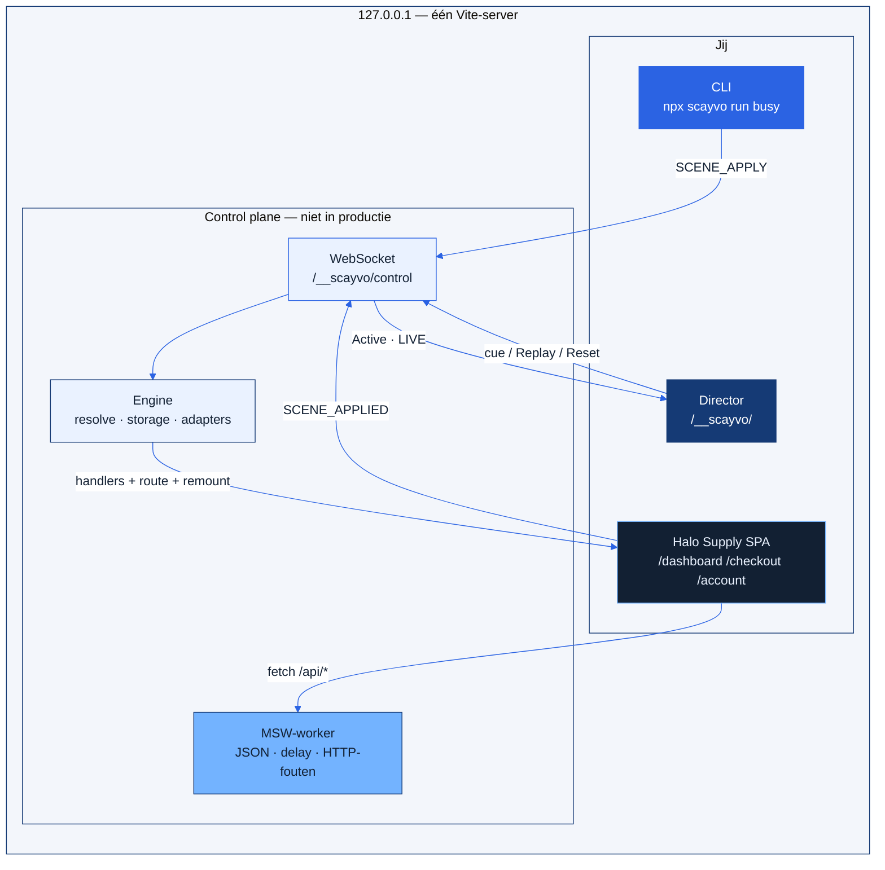
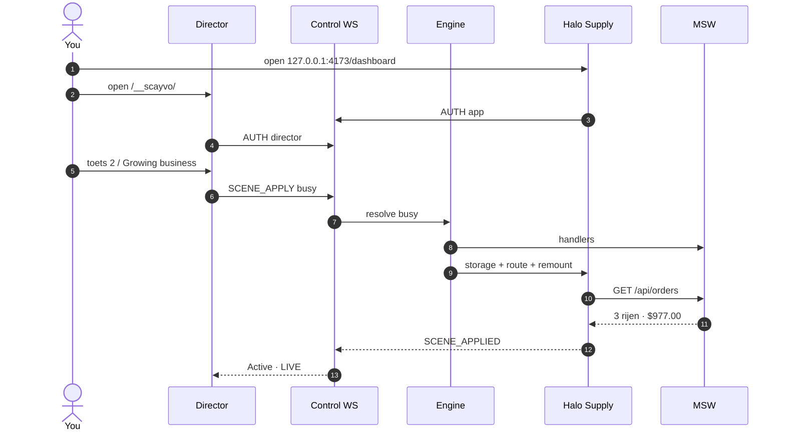

<p align="center">
  
</p>

<p align="center">
  <a href="./README.md">English</a> ·
  <a href="./README.nl.md">Nederlands</a> ·
  <a href="./README.ar.md">العربية</a>
</p>

<p align="center">
  
  
  
  
  
  
</p>

Lokale scene-controller voor een draaiende React + Vite SPA. Definieer de demo één keer. Wissel routes, MSW-mocks en allowlisted storage met één toets — zonder rebuild, zonder volledige reload, zonder `localStorage.clear()`.

Director draait op **dezelfde Vite-server** op `/__scayvo/`. Productie-builds bevatten geen controleroutes, worker of fixtures.

---

## Bekijk het

[**▶ Volledige walkthrough (MP4, ~90s)**](docs/assets/walkthrough.mp4)

<p align="center">
  
</p>

<p align="center">
  <a href="docs/assets/walkthrough.mp4">
    
  </a>
</p>

---

## Galerij

<p align="center">
  
</p>

| Director | Halo Supply-demo |
| :---: | :---: |
|  |  |
|  |  |
|  |  |

<p align="center">
  
</p>

---

## Inhoud

- [Wat het is](#wat-het-is)
- [Hoe het in elkaar zit](#hoe-het-in-elkaar-zit)
- [Kleuren](#kleuren)
- [Wat v0.1 niet doet](#wat-v01-niet-doet)
- [Halo Supply-demo starten](#halo-supply-demo-starten)
- [Director](#director)
- [Toetsenbord](#toetsenbord)
- [Installeren in jouw app](#installeren-in-jouw-app)
- [CLI](#cli)
- [Hoe een scene wordt toegepast](#hoe-een-scene-wordt-toegepast)
- [Netwerk en opslag](#netwerk-en-opslag)
- [Tests (A→Z)](#tests-az)
- [Mappenstructuur](#mappenstructuur)
- [Documentatie](#documentatie)
- [Problemen](#problemen)
- [Auteur en steun](#auteur-en-steun)
- [Licentie](#licentie)

---

## Wat het is

SCAYVO is een **alleen-loopback** director voor demo’s:

| Onderdeel | Wat je krijgt |
| --- | --- |
| Scenes | Titel, volgorde, route, allowlisted storage, REST-mocks, adapterdata |
| Director | Licht navy dashboard op `/__scayvo/` in hetzelfde Vite-proces |
| Remote | Toetsen altijd in Director; in de **app**-tab alleen na Remote mode |
| React | Expliciete remount + afbreekbare generaties (`context.signal`) |
| Netwerk | MSW in de browser: JSON, fixtures, HTTP-fouten, delay, netwerkfouten |
| CLI | `init` · `dev` · `list` · `run` · `reset` · `validate` |

v0.1 bestuurt **alleen gedeclareerde bronnen en geregistreerde adapters**. Geen “elke state”, databases, SSR, cookies, IndexedDB of productieverkeer.

De publieke npm-naam `scayvo` is een werktitel. **Deze repo publiceert niet naar npm.** Installeer geen `scayvo` van de registry. Pack een lokale tarball.

---

## Hoe het in elkaar zit

Eén Vite-proces. App, Director, WebSocket en MSW-worker blijven op loopback.



Apply = **baseline + defaults + scene**. Ook de huidige scene wordt opnieuw voorbereid.



---

## Kleuren

Director is navy + signaalblauw op ijs-papier. Halo Supply blijft een aparte donkere storefront — dat is de voorbeeldapp, niet de tool.

<p align="center">
  
  
  
  
  
</p>

| Token | Hex | Waar |
| --- | --- | --- |
| Navy | `#153a75` | Sidebar, filmmodus, primaire CTA |
| Signal blue | `#2b63e3` | Focus, links, LIVE |
| Sky | `#73b3ff` | Randen, glow, badge-outline |
| Ice | `#eaf2ff` | Metric-kaarten, zoeken, LIVE-rij |
| Heat | `#e05645` | Reset, fouten, recovery |
| Paper | `#f3f6fb` | Director-canvas |
| Ink | `#122033` | Bodytekst |

Lettertypen: **Plus Jakarta Sans** (UI) + **IBM Plex Mono** (ids, shortcuts).

---

## Wat v0.1 niet doet

Globale nepklok, Next.js/SSR, GraphQL, WebSocket-mocks, capture, cloud, AI, billing, visuele scene-editors, OS-globale hotkeys, samenleven met een PWA-worker.

---

## Halo Supply-demo starten

Node **≥ 20.11**. Blijf op loopback.

```bash
git clone https://github.com/Scayar/SCAYVO.git
cd SCAYVO
npm install
npm run build
npm install --prefix examples/demo
npm run start --prefix examples/demo -- --host 127.0.0.1 --port 4173 --strictPort
```

| Oppervlak | URL |
| --- | --- |
| App | http://127.0.0.1:4173/ |
| Director | http://127.0.0.1:4173/__scayvo/ |

`--host 0.0.0.0` **zet controleroutes uit**.

Vanuit `examples/demo`:

```bash
npm start -- --host 127.0.0.1 --port 4173 --strictPort
```

Gebruik **niet** `npm run demo -- --host …` in de repo-root — nested npm geeft die flags niet door aan Vite.

Halo Supply heeft drie routes. Zes scenes gaan via `fetch('/api/…')`, niet via een scene-id in de markup.

| Toets | Scene | Wat je ziet |
| --- | --- | --- |
| `1` | Empty dashboard | 0 orders, **$0.00** |
| `2` | Growing business | 3 orders, **$977.00** uit de fixture |
| `3` | Slow API | Skeleton ~4s, daarna dezelfde 3 orders |
| `4` | Server error | Dashboardfout HTTP 500 (`demo_server_error`) |
| `5` | Payment declined | Checkout. Toast pas **na** Pay (`card_declined`) |
| `6` | Premium account | Naam Talal, plan `premium` |

**Replay** (`Space`) op payment-failed wist formulier en toast; Pay faalt opnieuw. **Reset** zet managed keys terug en mount **zonder** SCAYVO-mocks. Geen echte backend? `/api/orders` kan HTML teruggeven — dat is normale modus, geen restore-bug.

---

## Director

Zelfde origin als de app. Navy CTA, ice-metriekkaarten, cue sheet, transport, shortcutlijst.

<p align="center">
  
</p>

| Bediening | Betekenis |
| --- | --- |
| Cue sheet | Klik een scene. Actieve rij is ice + **LIVE** |
| Replay scene | Bereidt ook de **huidige** scene opnieuw voor |
| Previous / Next | Geen wrap |
| Reset | Baseline + normale mount, mocks uit |
| Remote mode in app | Cijfers/pijlen/Space in de **app**-tab |
| Hide DEMO MODE badge | Badge-tekst blijft `DEMO MODE` |
| Film mode (`D`) | Groot take-beeld. `Esc` sluit |
| Zoeken (`/`) | Filter op titel, id of hotkey |
| Diagnostics | Enginefouten en geblokkeerde in-scope requests |

Handshake: **Connected** na authenticatie van de app. **Active** pas na `SCENE_APPLIED`. Alleen een socket is geen succes.

Als de laatste Director weggaat, **blijven** de mocks. Geen fall-through naar het echte netwerk.

---

## Toetsenbord

Toetsen negeren typen, IME, modifiers en herhaling. Pagina-niveau, niet OS-globaal.

| Toets | Actie |
| --- | --- |
| `1`–`9` | Scene volgens `order` |
| `←` `→` | Vorige / volgende, geen wrap |
| `Space` | Replay huidige scene |
| `R` | Reset |
| `D` | Filmmodus (Director) |
| `/` | Focus zoekveld (Director) |
| `Esc` | Film uit (Director); Remote uit in de **app** |

Cijfers en pijlen in de app-tab werken alleen na **Remote mode in app**.

---

## Installeren in jouw app

### 1. Lokale tarball (niet de publieke registry)

```bash
cd /path/to/SCAYVO
npm install
npm run build
npm pack
```

```bash
cd /path/to/your-app
npm install -D /path/to/scayvo-0.1.0.tgz
npx scayvo init
```

`init` schrijft `scayvo.config.ts`, `src/scayvo.dev.ts` en een sample-fixture **alleen als ze nog niet bestaan**.

### 2. Vite-plugin

```ts
import { defineConfig } from 'vite';
import react from '@vitejs/plugin-react';
import { scayvo } from 'scayvo/vite';

export default defineConfig({
  plugins: [react(), scayvo()],
  server: { host: '127.0.0.1' },
});
```

Controleroutes alleen tijdens `vite` **serve**, alleen op loopback.

### 3. Productie afschermen

```ts
async function main() {
  if (import.meta.env.DEV) {
    const { startDemoDevelopment } = await import('./scayvo.dev');
    await startDemoDevelopment();
    return;
  }
  const { mountNormalApp } = await import('./bootstrap');
  await mountNormalApp();
}
void main();
```

### 4. Sessiebestand

Registreer adapters uit `custom`, wacht op SCAYVO (inclusief MSW-worker), importeer daarna modules die `fetch` aanroepen.

Optioneel: `scayvo/react` → `createReactIntegration(target, render)` met `flushSync`.

Maak stores en query clients **in `mount`**. Geef `context.signal` door aan `fetch`. `mount` resolved na de eerste bruikbare shell, niet na elk netwerkverzoek. `dispose()` breekt fetches/timers af en unmount.

Exports: `scayvo`, `scayvo/vite`, `scayvo/client`, `scayvo/react`.

---

## CLI

Binary: `scayvo` → `dist/cli/index.js`. Draai vanuit de **app**-map (waar `scayvo.config.ts` staat). `run` / `reset` hebben Vite nodig zodat `.scayvo/runtime.json` bestaat.

```bash
npx scayvo init
npx scayvo validate
npx scayvo list                 # geen server nodig
npx scayvo dev                  # Vite serve op 127.0.0.1 + Director-URL
npx scayvo run payment-failed   # wacht op SCENE_APPLIED
npx scayvo reset
```

Tweede terminal terwijl de demo draait:

```bash
cd examples/demo
npx scayvo list
npx scayvo run busy
npx scayvo run payment-failed
npx scayvo reset
```

`run` praat met een **al draaiende** dev-server via het runtime-bestand. Geen `--base-url`. Geen browser. Exit pas na de app-acknowledgement.

Exitcodes: `0` ok, `1` exec, `2` ongeldige config, `3` geen client, `4` busy/timeout.

---

## Hoe een scene wordt toegepast

Scenes resolven als **baseline + defaults + scene**. Geen overgebleven state van de vorige scene.

Apply **bereidt ook de huidige scene opnieuw**. Replay doet hetzelfde. Geen full page reload.

`payment-failed` = de **volgende** Pay-request faalt. De toast komt pas na submit.

Config is lokale TypeScript in Node. Scene-ids: lowercase kebab-case. `order` noemt elke scene één keer. Fixtures relatief, JSON, daarna inline. Symlink-escape buiten de projectroot faalt vóór mutatie.

---

## Netwerk en opslag

- Matchers zijn letterlijk. Extra querykeys mogen; gedeclareerde keys gebruiken gelijkheid.
- `/api/` matcht geen `/apiary`.
- In-scope zonder matcher wordt **geblokkeerd** en in Director getoond.
- `delayMs` is 0–30000, geen app-timeout.
- Alleen `managedStorage`. Nooit `localStorage.clear()`.
- Eén app-client per sessie. Tweede tab geweigerd.
- MSW is de interceptor. Geen handmatig `fetch`-patch. Geen GraphQL/WebSocket in v0.1.

---

## Tests (A→Z)

```bash
npm run typecheck
npm run test
npx playwright install chromium
npm run test:e2e
```

Playwright wil poort **4173**. Stop de demo eerst.

| Suite | Laatste run | Resultaat |
| --- | --- | --- |
| Vitest | 15 sep 2026 | **25 geslaagd** |
| Playwright Chromium | 15 sep 2026 | **14 geslaagd** |

Niet geautomatiseerd: adapter die midden in apply gooit; `WORKER_CONFLICT` tegen een vreemde PWA-worker; visuele pixelsnapshots.

Zie [tests/RESULTS.md](tests/RESULTS.md).

---

## Mappenstructuur

```text
src/core/        types, defineScayvo, validate, resolve
src/vite/        plugin, loopback HTTP/WS, worker, Director
src/client/      engine, storage, journal, keyboard, overlay
src/react/       createReactIntegration
src/cli/         init, dev, list, run, reset, validate
src/director/    Director-UI
examples/demo/   Halo Supply
docs/            documentatie + assets
tests/           unit, integratie, Playwright
```

---

## Documentatie

| Doc | Onderwerp |
| --- | --- |
| [docs/getting-started.md](docs/getting-started.md) · [NL](docs/getting-started.nl.md) · [AR](docs/getting-started.ar.md) | Pakket, config, mount, handshake |
| [docs/limits.md](docs/limits.md) · [NL](docs/limits.nl.md) · [AR](docs/limits.ar.md) | Grenzen v0.1 |
| [docs/integrations.md](docs/integrations.md) · [NL](docs/integrations.nl.md) · [AR](docs/integrations.ar.md) | React, adapters, MSW |
| [docs/README.md](docs/README.md) | Hub + screenshots |
| [docs/github-presence.md](docs/github-presence.md) | GitHub About, topics, lancering |
| [CONTRIBUTING.md](CONTRIBUTING.md) | Bijdragen |
| [SECURITY.md](SECURITY.md) | Kwetsbaarheden |
| [LICENSE](LICENSE) | MIT |

---

## Problemen

| Symptoom | Oorzaak |
| --- | --- |
| Director blijft Waiting | Geen app-tab op dezelfde origin |
| `/__scayvo/` 404 | Geen Vite-serve of geen loopback |
| Toast al zichtbaar bij payment-failed | Scene = **volgende** Pay; klik Pay |
| Na Reset JSON-fout op `<!DOCTYPE` | Geen echte `/api` — verwacht |
| `npm install scayvo` van npm | Verkeerd pakket — pack deze repo |
| Playwright poort 4173 bezet | Stop de demo |
| `npm run demo -- --host` verandert de poort niet | Flags bereiken Vite niet. Gebruik `npm run start --prefix examples/demo -- …` |

---

## Licentie

MIT. Lokaal ontwikkelhulpmiddel. Zet `/__scayvo/` niet op een gedeeld netwerk.

---

## Auteur en steun

**[Scayar](https://github.com/Scayar)** — Nederland. [Scayar.com](https://Scayar.com) · [MezaOS](https://MezaOS.com)

<p align="center">
  <a href="https://Scayar.com"></a>
  <a href="mailto:Scayar.exe@gmail.com"></a>
  <a href="https://t.me/im_scayar"></a>
  <a href="https://buymeacoffee.com/scayar"></a>
</p>

<p align="center">
  <br />
  <sub>Gemaakt door <a href="https://scayar.com">Scayar</a> · Je volgende demo. Eén toets verwijderd.</sub>
</p>
